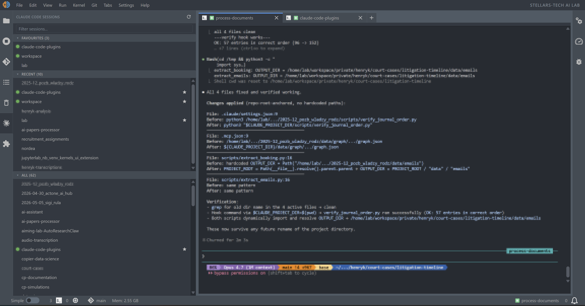

# jupyterlab_claude_code_extension

[](https://github.com/stellarshenson/jupyterlab_claude_code_extension/actions/workflows/build.yml)
[](https://www.npmjs.com/package/jupyterlab_claude_code_extension)
[](https://pypi.org/project/jupyterlab_claude_code_extension/)
[](https://pepy.tech/project/jupyterlab_claude_code_extension)
[](https://jupyterlab.readthedocs.io/en/stable/)
[](https://kolomolo.com)
[](https://www.paypal.com/donate/?hosted_button_id=B4KPBJDLLXTSA)

A full Claude Code launcher and manager for JupyterLab. Start, resume, fork, switch, and clean up Claude Code CLI sessions from a side panel - one click lands you in the right terminal with Claude already running, no duplicate tabs, no UUID hunting, with a live indicator showing which sessions are active right now.



## Why this extension

One principle: **Anthropic knows best how to build the agent harness; we know best how to make it work in JupyterLab.**

Chat-panel extensions re-implement the agent loop and trail the real tool. This one runs the genuine, unmodified Claude Code CLI in JupyterLab terminals - skills, subagents, MCP, hooks, plan mode, every release the day it lands. The extension owns the JupyterLab side:

- **Launching** - new, resumed, or forked sessions, with or without permission prompts, no wrapper shell, correctly sized before Claude draws its first frame
- **Finding** - every Claude project in one panel: favourites, search, live activity
- **Reusing** - clicking a session focuses its existing terminal, never a duplicate
- **Managing** - parallel conversations: switch, fork with a name, delete - no `--resume` pickers, no raw UUIDs

## Features

- **Three-section side panel** - Favorites, Recent, and All projects, each scrolling independently
- **Remote control indicator** - a green dot marks sessions that are actively under Claude's remote control, not merely a terminal that happens to be running
- **One-click resume** - click a row to jump back into that session in a terminal. If a terminal for the project is already open, it's reused instead of duplicated
- **Favorites** - star projects you keep coming back to via the right-click menu
- **Remove** - drop a project's Claude history from the panel via the right-click menu; a confirmation dialog names the project and warns it removes the whole project and all its conversations before anything is touched, then the history folder is moved to the trash (it honours JupyterLab's "move files to trash" setting), not deleted permanently
- **Clean up parallel sessions** - when a project has accumulated extra sessions beyond the main one, a right-click menu item (showing the count in brackets) removes them all, keeping only the main session; a confirmation dialog naming the project and the count appears first, and removed files honour the same trash setting
- **Conversation switcher** - a right-click "Switch and Manage Sessions" submenu lists a project's other conversations by name and short session id, e.g. `home (3f2a1b9c)`, with last-activity time; pick one and it becomes the row's current conversation - the next click resumes exactly that one. The submenu shows the 5 most recent; "Manage Sessions..." opens a searchable popup - a scrollable table over the full list with the current conversation pinned at the top and accented. Conversations can also be deleted here - select one, many, or all via checkboxes, then click Delete; they move to trash immediately (no confirmation, with an "N moved to trash" message; removed files honour the trash setting). Rows with multiple conversations show a branch icon with the count after the name
- **Open branched conversation** - a separate right-click "Open Branched Conversation" submenu (and an "Open" button on every row of the Manage Sessions popup) opens any conversation directly in its own terminal, so several branches of one project can run side by side; clicking a row reuses an open terminal only when it is already running that exact conversation, so switching a branch and clicking lands you in the right one rather than the original
- **Branch session** - fork the current conversation into a new named session via the right-click menu (normal or skip-permissions mode); uses Claude's native `--fork-session`, opens in a new terminal, the chosen name is stamped automatically, and the fork becomes the row's current conversation
- **Copy session id** - a right-click "Copy Session ID" item copies the row's current conversation id to the clipboard; the Manage Sessions popup adds a copy button on every row, so any parallel conversation's id is one click away
- **Activity at a glance** - each row shows its last activity (`now`, `5m ago`, `2h ago`, `3d ago`) in an aligned column, with the favourite star in its own column beside it; rows active within the last minute light up in the theme's brand colour (including the `now` label), rows idle for over a week dim slightly
- **Coloured terminal tabs** - each Claude session's colour (set with `/color`, or auto-assigned) tints its terminal tab, so open sessions are easy to tell apart; needs the companion `jupyterlab_colourful_tab_extension` (>= 1.0.19), which supplies the tab-colouring API
- **Search** - fuzzy filter toggled by the funnel button next to refresh
- **Presentation modes** - label rows by session name (so a `/rename` shows through), folder name, or path relative to the JupyterLab root
- **Hover tooltip** with project path, last activity, message count, branch, and session id
- **Auto-disabled** when the Claude Code CLI is not installed

## Requirements

- JupyterLab >= 4.0.0
- Python >= 3.10
- `claude` CLI on `PATH`

## Install

Developers must install via the project `Makefile` (which orchestrates clean, build, and pip install of the resulting wheel):

```bash
make install
```

End-users can install the published package from PyPI:

```bash
pip install jupyterlab_claude_code_extension
```

> [!WARNING]
> `package.json` pins `webpack: 5.106.0` and `chalk: 4.1.2` in both `resolutions` and `overrides`. Do not remove these. webpack `>= 5.106.1` changed its module-federation share identifier format and crashes the unmaintained `license-webpack-plugin` (`split('=')[1].trim()`) that `@jupyterlab/builder` injects into every production build; the duplicate `chalk@2.4.2` pulled by `duplicate-package-checker-webpack-plugin` crashes on Node 24+ in the build-isolation install. Without the pins, `make publish` and CI fail on `python -m build`.

## Claude statusline

The package ships a companion CLI that installs the [claude-code-statusline](https://github.com/stellarshenson/claude-code-statusline) powerline status line (context %, model, effort, git, env, pwd) into `~/.claude` and points `statusLine` in `settings.json` at it - after asking for confirmation, since it downloads the script from that repo:

```bash
jupyterlab_claude_code install-claude-statusline
```

## Uninstall

```bash
pip uninstall jupyterlab_claude_code_extension
```
