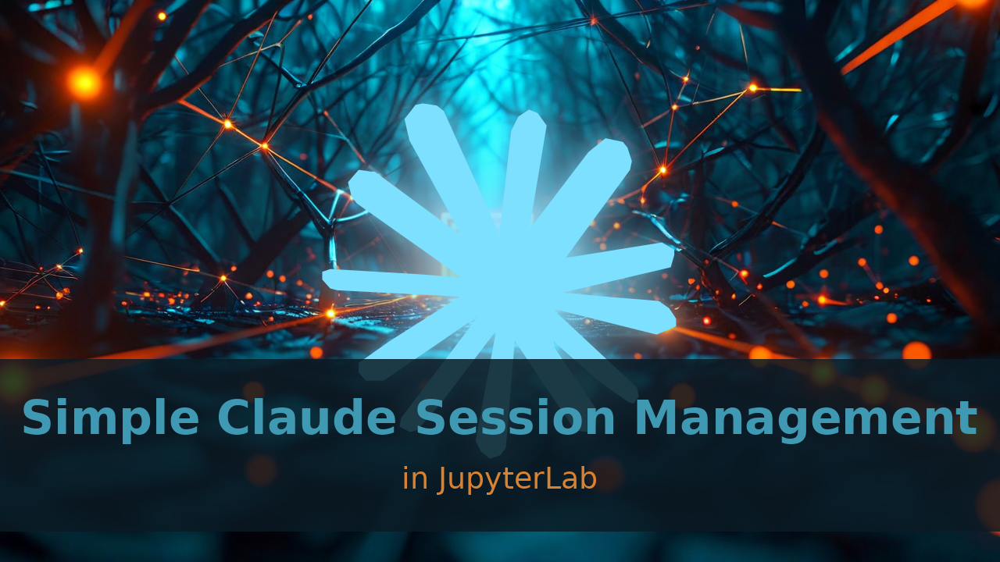
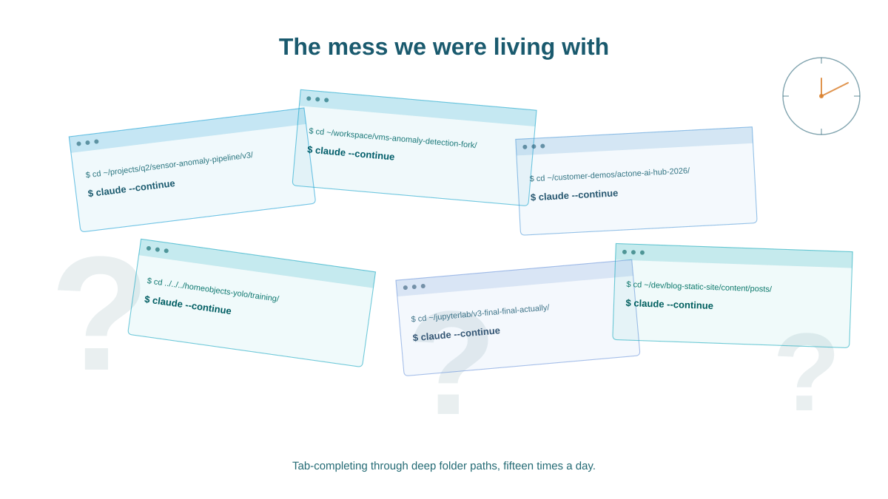
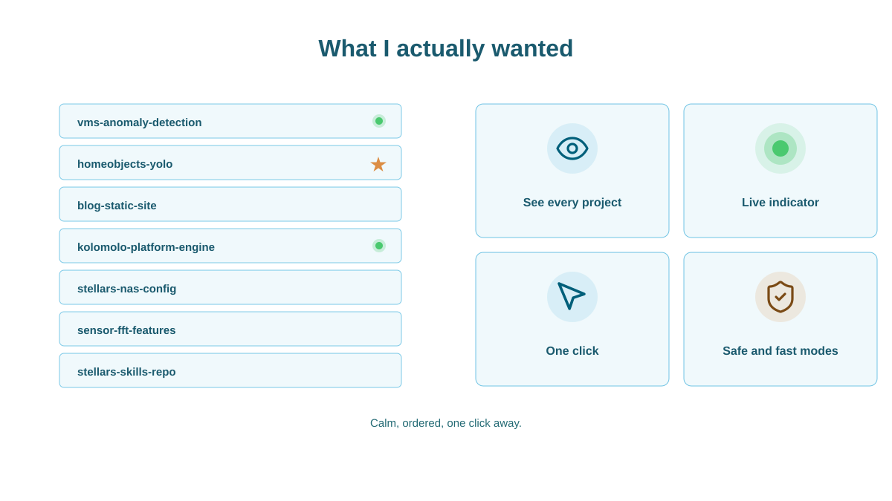
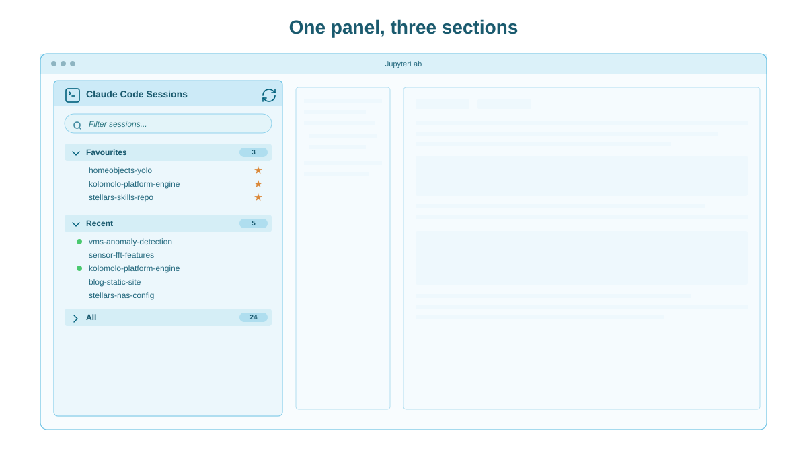
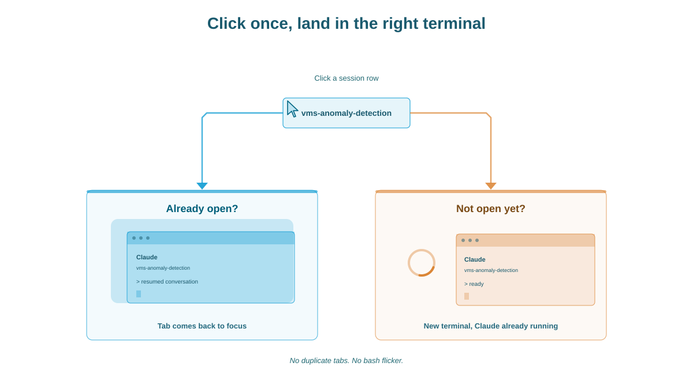
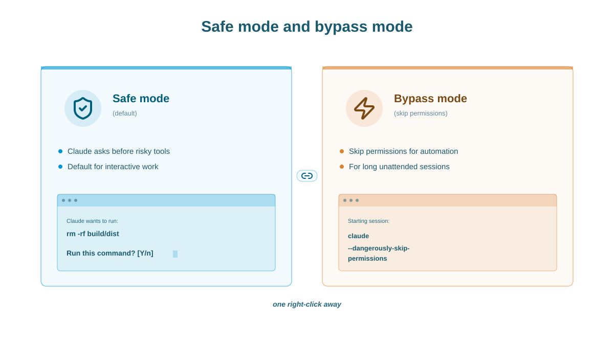

# I Wanted Simple Claude Session Management in JupyterLab



_One panel, three sections, no more cd-ing through deep folder paths to remember which project is which._

---

## Quickstart

```bash
pip install jupyterlab_claude_code_extension
```

Reload JupyterLab. Repo: [github.com/stellarshenson/jupyterlab_claude_code_extension](https://github.com/stellarshenson/jupyterlab_claude_code_extension).

---

## The Mess We Were Living With

If you've ever worked with Claude Code across more than a handful of projects, you know the feeling. You jump between fifteen folders a day, and every switch is the same friction: recall which path the project lives in, `cd` through five levels of nested folders, type `claude --continue`, hope it's the right one.

Some days you have three terminal tabs open for the same project because you forgot the first two. Some days the project lives behind a folder name that means nothing in isolation (`v3-final-final-actually`), and you grep your shell history for the right `cd` command, and pray.

None of it is hard. All of it is friction. Five minutes here, five minutes there, fifteen times a day, adds up to a serious chunk of an afternoon spent on plumbing instead of work.



## What I Actually Wanted

**Calm.** A single place where my Claude sessions live, ordered the way I think about them, with one click between me and the right conversation in the right folder.

Specifically:

- **Every project visible at a glance** - today's at the top, starred ones pinned, the rest searchable
- **Favourites pinned** - the three or four projects I live in, always one click away
- **A green dot for live sessions** - not just "I left a terminal open", but "this session is being remotely controlled right now" (from your phone, from a Claude.ai tab, from automation). Glance at the panel and you know which projects are working without you
- **One click to the right terminal** - existing tab if already open, fresh terminal if not, never a duplicate
- **Two launch flavours** - safe by default, skip-permissions when you trust the script



## The Panel

It's a JupyterLab extension that lives in your left sidebar. Three sections, vertically stacked: **Favourites** at the top (when you have any), **Recent** below, **All** at the bottom.

Every row is a project, labelled by session name, folder, or relative path (your choice in settings). A **green dot** on the left means the session is being remotely controlled right now. A **filled star** on the right means you favourited it. Right-click for actions. A fuzzy search at the top means `vmsanoml` lands you on `vms-anomaly-detection-pipeline` on the third sip of coffee.

The whole thing is a sidebar. It does not steal focus, does not pop dialogs you didn't ask for, does not poll loudly.



## One Click, Right Terminal

Click a row. If you don't have a terminal open for that project, a small modal pops while one spawns, and you land in a fresh terminal with Claude already running and resumed at the right session. No bash prompt flashing in between, no `cd`, no `claude --continue` to remember.

If you _do_ have a Claude terminal open for that project, the panel skips the spawn and brings that existing tab back to focus. **No duplicate tabs.** The first time I clicked the same row three times in a minute and ended up with one terminal, not three, I knew the panel was earning its keep.



## Safe Mode and Bypass Mode

Right-click any row for two launch entries. **Resume** opens Claude with its default permission prompts. **Resume (Skip Permissions)** uses `--dangerously-skip-permissions` - for long refactors, batch jobs, anything you trust to run unattended without babysitting a yes/no dialogue every few seconds.

A shield icon marks the skip-permissions entry. The default is safe. The fast mode is one extra click away.



## Why I Built This

I work across maybe fifteen active projects in a normal week. Most of the cognitive load of switching between them used to come from re-establishing context - which folder, which terminal, which session was alive.

The panel made that load go away. The sidebar gave me **the thing I actually needed**: a quiet visual map of my Claude work, with one click between me and any of it.

## Getting Started

```bash
pip install jupyterlab_claude_code_extension
```

Reload JupyterLab. The panel shows up in the left sidebar. If `claude` isn't on your PATH the extension stays disabled, so it's safe to install everywhere.

It's a regular JupyterLab 4 extension - drop it into any JupyterLab instance you already run. It also ships preinstalled in [stellars-jupyterlab-ds](https://github.com/stellarshenson/stellars-jupyterlab-ds), my ready-to-use development platform built on JupyterLab. Repo at [github.com/stellarshenson/jupyterlab_claude_code_extension](https://github.com/stellarshenson/jupyterlab_claude_code_extension). Issues and PRs welcome.

If you live across projects and use Claude Code daily, give it a try. If it saves you the five minutes a day I think it will, that's roughly a free afternoon a month back in your week.

---

_Konrad "Stellars" Jelen is a data scientist, enterprise architect, and entrepreneur. He builds tooling, models, and platforms for industrial sensor data at Kolomolo._
